# Splunk Home SOC Lab: Detecting a Brute-Force Attack

A self-built SOC lab where I forwarded logs from a Windows 10 victim and a Parrot Linux attacker into a centralized Splunk instance, then simulated and detected a real SMB brute-force attack end to end — from raw attack traffic to a triggered Splunk alert.

## 🎯 Goals

- Stand up a mini SIEM using Splunk Enterprise
- Ingest Windows Event Logs + Sysmon telemetry, and Linux system/auth logs, from separate hosts
- Simulate a real brute-force attack from Parrot against a Windows 10 VM
- Detect the attack using Splunk searches, build a dashboard, and trigger an automated alert

## 🏗️ Architecture

```
[ Parrot VM (attacker) ] ---- SMB brute force (nxc) ---->  [ Windows 10 VM (victim + Splunk) ]
        |                                                          |
        |  Universal Forwarder                        Local indexing
        |  (syslog, auth.log)                    (Security, System, Application, Sysmon)
        v                                                          v
                     [ Splunk Enterprise — indexer + search head ]
                              (running on the Windows 10 VM)
```

All VMs run on VirtualBox, connected via a **Host-only Adapter** so they can reach each other without exposing the lab to the outside network.

## 🧰 Tools Used

| Tool | Purpose | Link |
|---|---|---|
| VirtualBox | Hypervisor | https://www.virtualbox.org/wiki/Downloads |
| Windows 10 (Home) | Victim machine, also runs Splunk | — |
| Parrot Security OS | Attacker machine | https://www.parrotsec.org/download/ |
| Splunk Enterprise (free tier) | SIEM — indexer + search head | https://www.splunk.com/en_us/download/splunk-enterprise.html |
| Splunk Universal Forwarder | Ships Parrot's logs to Splunk | https://www.splunk.com/en_us/download/universal-forwarder.html |
| Sysmon | Deep process/network telemetry on the victim | https://learn.microsoft.com/en-us/sysinternals/downloads/sysmon |
| SwiftOnSecurity Sysmon config | Sane Sysmon logging ruleset | https://github.com/SwiftOnSecurity/sysmon-config |
| NetExec (nxc) | Modern SMB brute-force tool | pre-installed on Parrot |
| Nmap | Port/service discovery | pre-installed on Parrot |

## 📋 Build Log

### 1. Lab setup
Deployed Windows 10 and Parrot as VirtualBox VMs, both attached to the same **Host-only Adapter** so they share a private subnet and can reach each other without touching the real network.

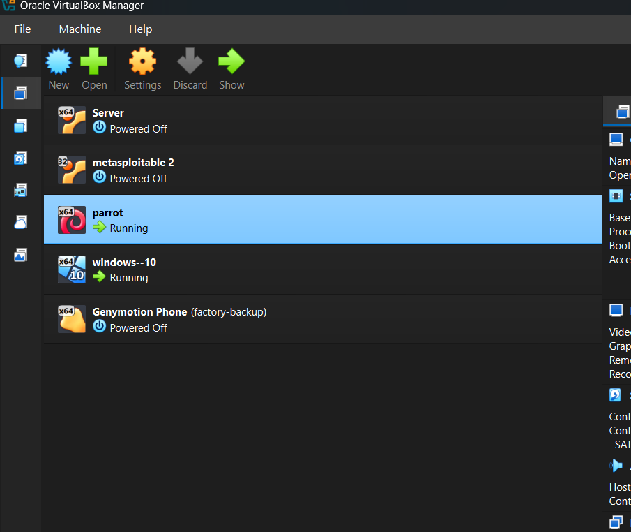
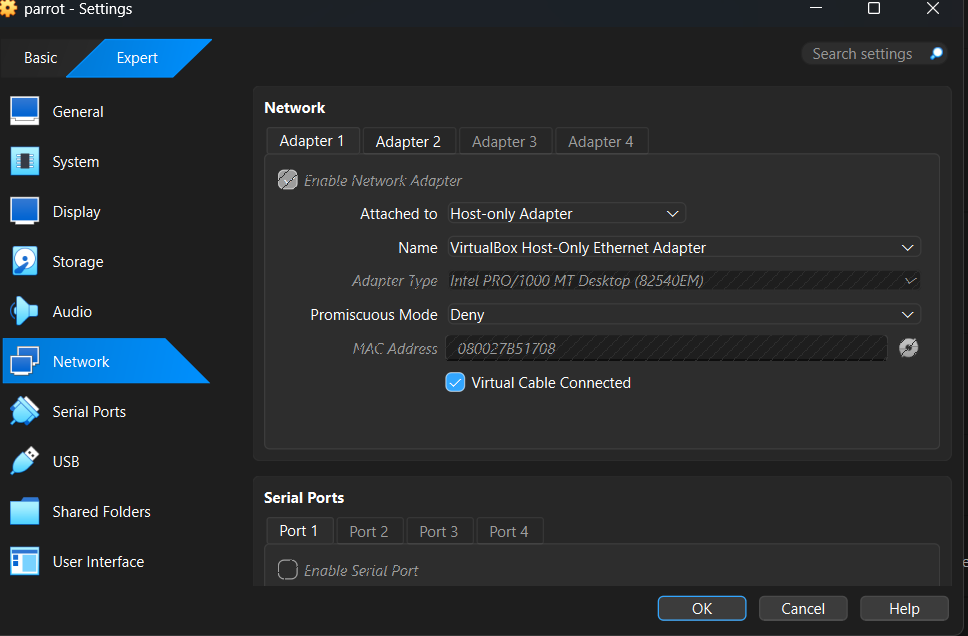

**Troubleshooting hit:** Initial `ping` between the VMs returned 100% packet loss. Root cause: Windows Defender Firewall blocks inbound ICMPv4 Echo Requests by default. Fixed by enabling the **"File and Printer Sharing (Echo Request - ICMPv4-In)"** inbound rule on the Windows 10 VM.

### 2. Splunk Enterprise install + receiving
Installed Splunk Enterprise directly on the Windows 10 VM (acting as both the victim and the indexer/search head), and enabled it to receive forwarded data on TCP port **9997**.

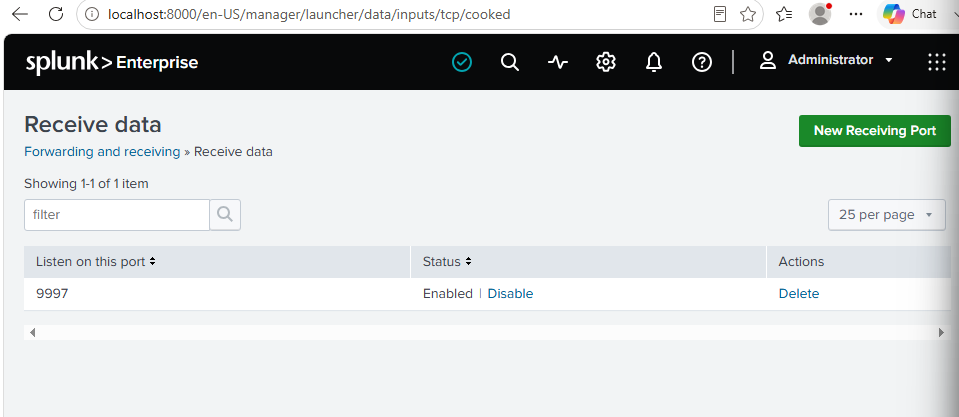

**Troubleshooting hit:** The receiving port showed "listening" locally but forwarders from other machines couldn't connect. Root cause: Windows Firewall had no inbound rule for TCP 9997. Fixed by adding an inbound rule (Advanced Firewall → Inbound Rules → New Rule → Port → TCP 9997 → Allow, all profiles).

### 3. Windows 10's own logs
Splunk indexes its own host's Application, Security, and System event logs automatically since it runs locally on that machine — confirmed via `index=* | stats count by host, sourcetype`.

### 4. Sysmon on the victim
Installed Sysmon with the SwiftOnSecurity community config (far more useful than Sysmon's bare defaults) to capture process creation, network connections, and other deep telemetry beyond what standard Windows auditing provides:
```
sysmon64.exe -accepteula -i sysmonconfig-export.xml
```
Verified events populating under `Applications and Services Logs → Microsoft → Windows → Sysmon → Operational` in Event Viewer, then added `Microsoft-Windows-Sysmon/Operational` as a local Splunk data input.

### 5. Parrot forwarding its logs
Installed the Splunk Universal Forwarder on Parrot and pointed it at the Windows 10 VM's receiving port:
```bash
sudo /opt/splunkforwarder/bin/splunk add forward-server 192.168.56.107:9997
```
**Troubleshooting hit:** Parrot doesn't ship with `/var/log/syslog` or `/var/log/auth.log` by default (it uses `journald`). Installed `rsyslog` to generate these flat files, then monitored them:
```bash
sudo apt install rsyslog -y
sudo systemctl enable rsyslog && sudo systemctl start rsyslog
sudo /opt/splunkforwarder/bin/splunk add monitor /var/log/syslog
sudo /opt/splunkforwarder/bin/splunk add monitor /var/log/auth.log
sudo /opt/splunkforwarder/bin/splunk enable boot-start
```
Confirmed both `syslog` and `linux_secure` sourcetypes flowing in under host `parrot`.

### 6. The attack — SMB brute force
Windows 10 **Home** edition doesn't support inbound RDP, so the attack target was switched to **SMB (port 445)** instead.

```bash
nmap -Pn -p 445 192.168.56.107
```
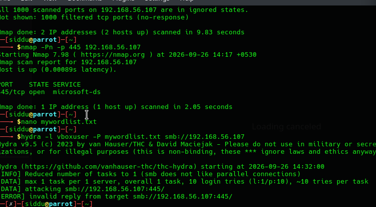

**Troubleshooting hit #1 — account lockout:** Windows Firewall was initially blocking SMB entirely (all ports showed "filtered"); fixed by enabling **File and Printer Sharing** through the firewall. After a few failed attempts, `net accounts` revealed a lockout threshold of 10 attempts / 10-minute lockout, which was stalling further testing:
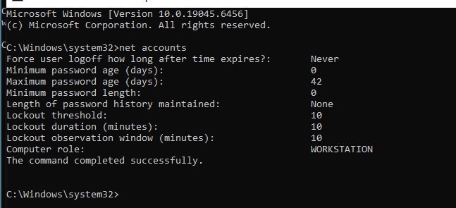
Disabled lockout for the lab environment: `net accounts /lockoutthreshold:0`

**Troubleshooting hit #2 — tool incompatibility:** Both **Hydra** and **Ncrack**'s SMB modules failed to negotiate with Windows 10's SMBv2/3 stack (they largely expect the deprecated SMBv1). Verified the login itself worked fine via `smbclient`:
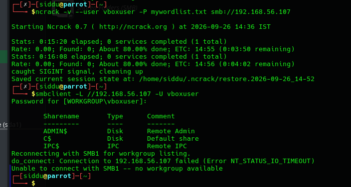
Switched to **NetExec (`nxc`)**, a modern tool built for SMBv2/3, which worked immediately:

```bash
nxc smb 192.168.56.107 -u vboxuser -p mywordlist.txt
```
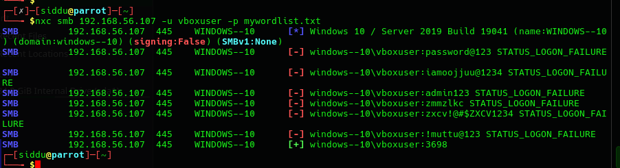

Result: 5 failed password attempts, followed by one successful login — full brute-force pattern replicated cleanly.

### 7. Detecting the attack in Splunk

**Failed logon attempts (Event ID 4625):**
```spl
index=* EventCode=4625 Account_Name=vboxuser
```
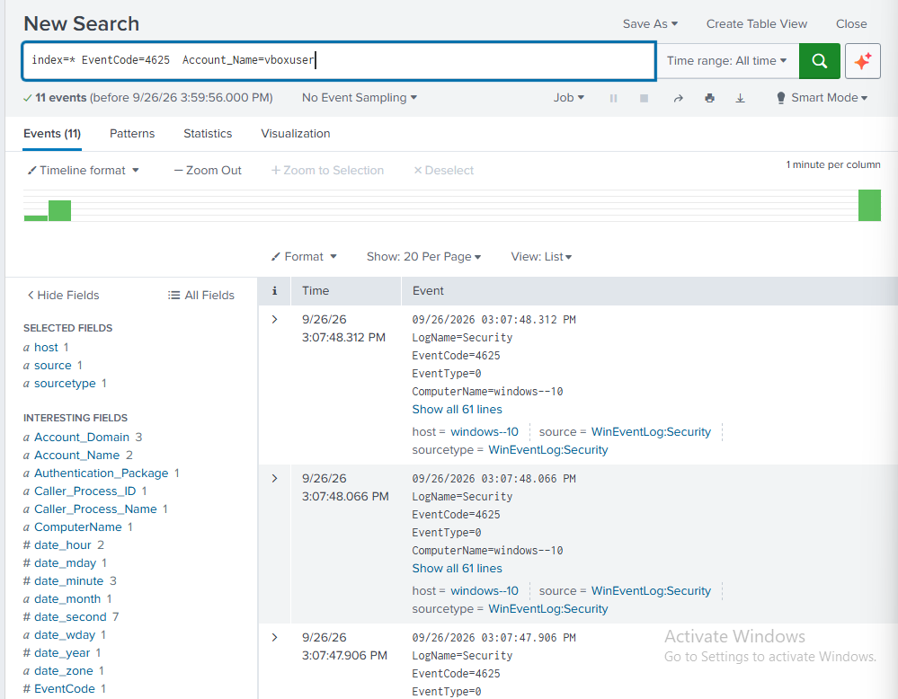

**Full attack timeline (failures → success, chronological):**
```spl
index=* (EventCode=4625 OR EventCode=4624) Account_Name=vboxuser
| sort _time
| table _time, EventCode, Account_Name, Logon_Type, src_ip
```
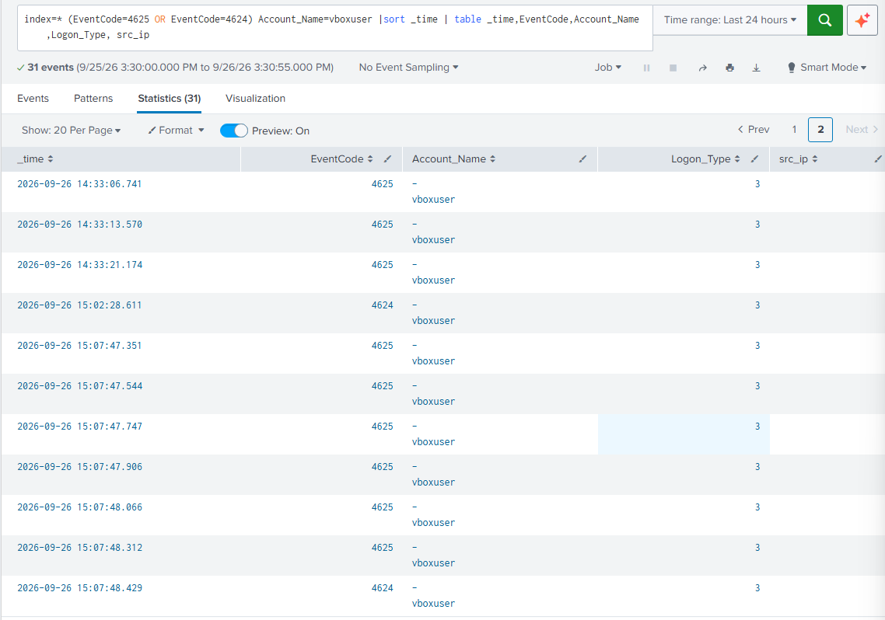

**Isolating the exact successful breach** (Logon_Type=3 = Network logon, the type SMB produces):
```spl
index=* EventCode=4624 Account_Name=vboxuser Logon_Type=3
```
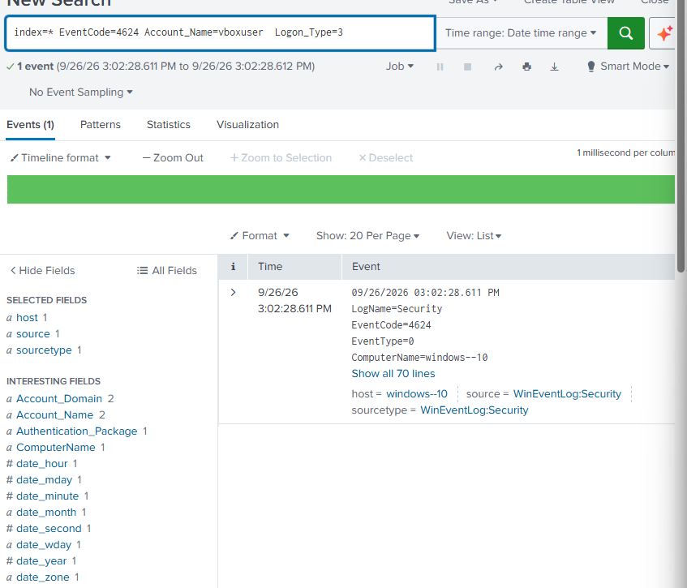

### 8. Dashboard
Built a Splunk dashboard, **"SOC Lab - Brute Force Detection,"** with three panels:

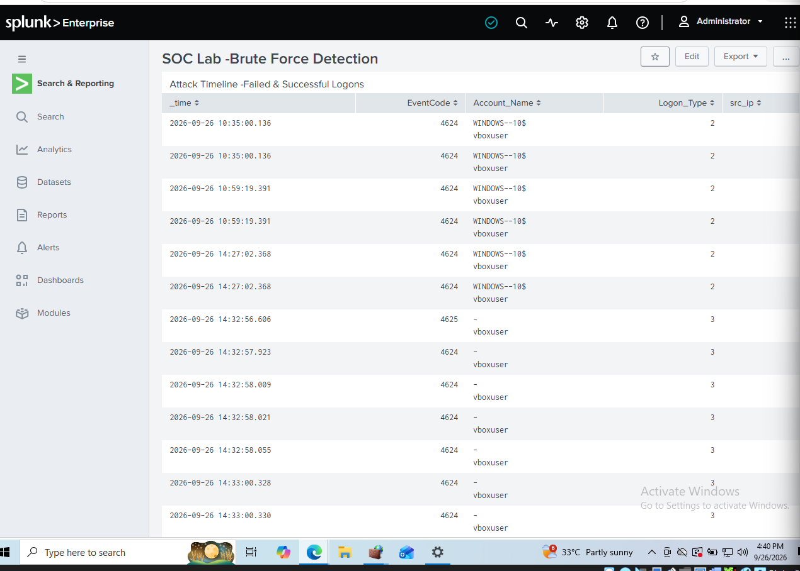
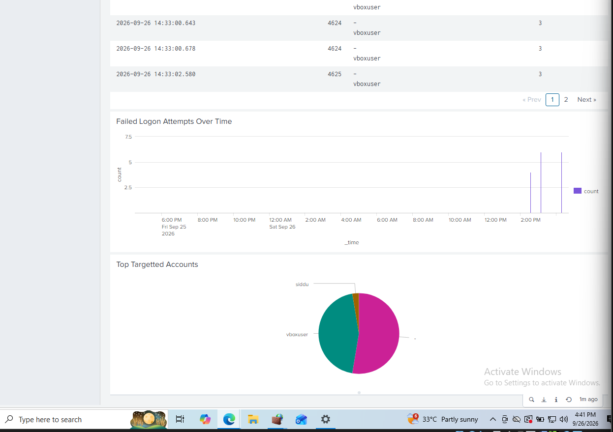

- **Attack Timeline** — raw table of every 4625/4624 event for the account
- **Failed Logon Attempts Over Time** — line chart showing the attack spike
- **Top Targeted Accounts** — pie chart of which accounts were targeted

### 9. Alert
Created a scheduled Splunk alert that fires when failed logons for a single account exceed a threshold:
```spl
index=* EventCode=4625
| stats count by Account_Name
| where count > 5
```
Scheduled to run every 5 minutes (`*/5 * * * *`) over a rolling window.

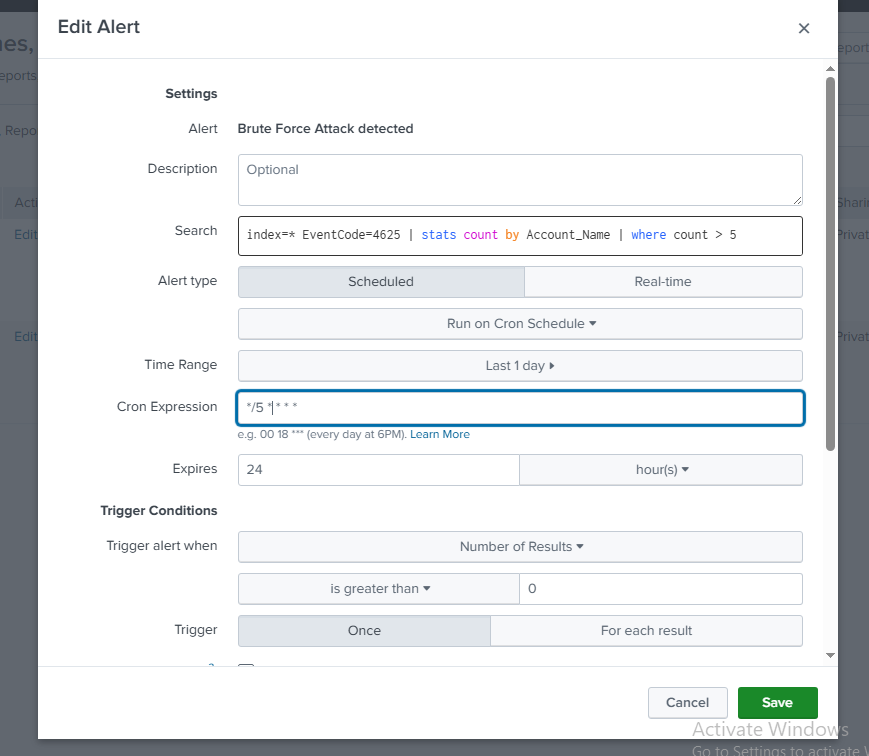

**Troubleshooting hit:** A stray character in the cron expression (`*/5 *| * * *`) caused Splunk to silently default to a once-daily schedule instead of every 5 minutes. Fixed by re-entering a clean cron string.

Re-ran the attack to confirm the alert fires correctly:
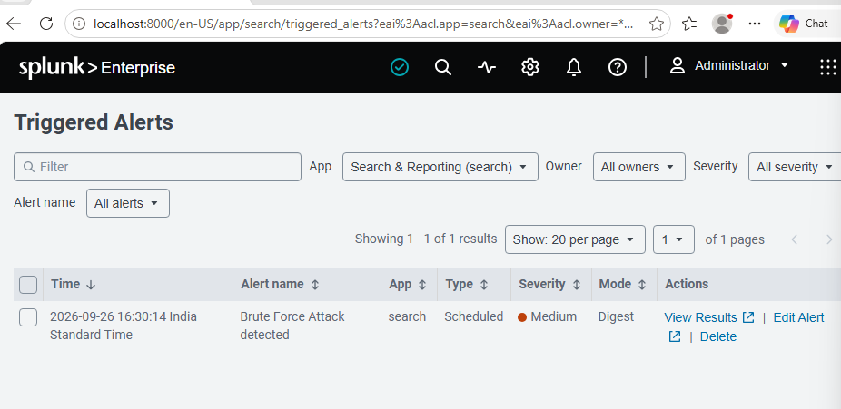

## 📊 Results

- Captured a complete SMB brute-force attack end to end: 11+ failed login attempts followed by one successful breach, all correctly logged as Windows Security events (4625/4624).
- Built a working dashboard visualizing the attack in real time.
- Built and verified a working automated alert that detects the same attack pattern within minutes.

## 🔭 Limitations & Real-World Context

This detection rule (`count > 5` failed logons in a short window) is a **basic signature-based detection** — it works well against a loud, fast brute-force attack like the one simulated here, but real-world attackers frequently evade this exact kind of threshold by:
- Spacing attempts out over hours/days ("low and slow" brute forcing)
- Trying one or two passwords across many accounts instead of many passwords against one account (password spraying)
- Using stolen or phished credentials entirely, generating **zero** failed logons
- Operating during low-monitoring windows and using encrypted C2 channels that evade simple network-based detection

Understanding these evasion techniques is why detection engineering also relies on anomaly-based rules (unusual login times, impossible travel, first-time source IPs) in addition to simple thresholds like the one built here.

## 📝 Disclaimer

This project was performed entirely in an isolated virtual lab against systems I own. No external or unauthorized systems were targeted.
